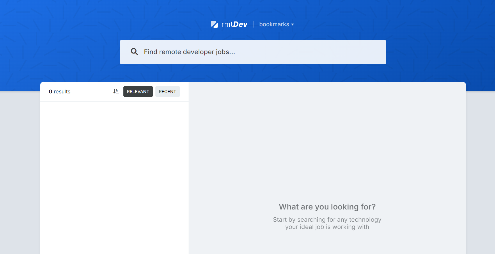

<a id="readme-top"></a>

<div align="center">
    <a href"mailto:aman304gupta@gmail.com">
        
    </a>
    <a href="https://www.linkedin.com/in/aman304gupta/">
      
    </a>
    <a href="https://aman304gupta-portfolio.vercel.app/">
      
    </a>
</div>

<!-- PROJECT LOGO -->
<br />
<div align="center">
  <a href="https://rmt-dev-job.vercel.app/">
    
  </a>

<h3 align="center">RmtDev</h3>

  <p align="center">
    A React-Typescript project to find remote developer jobs!!
    <br />
    <br />
    <a href="https://rmt-dev-job.vercel.app/">View Demo</a>
    ·
    <a href="https://github.com/aman304gupta/rmt-dev/issues/new?labels=bug&template=bug-report.md">Report Bug</a>
    ·
    <a href="https://github.com/aman304gupta/rmt-dev/issues/new?labels=enhancement&template=feature-request---.md">Request Feature</a>
  </p>
</div>

<!-- TABLE OF CONTENTS -->
<details>
  <summary>Table of Contents</summary>
  <ol>
    <li>
      <a href="#about-the-project">About The Project</a>
      <ul>
        <li><a href="#built-with">Built With</a></li>
      </ul>
    </li>
    <li><a href="#features">Features</a></li>
    <li><a href="#learnings">Learnings</a></li>
    <li><a href="#product-screenshots">Product Screenshots</a></li>
    <li>
      <a href="#getting-started">Getting Started</a>
      <ul>
        <li><a href="#prerequisites">Prerequisites</a></li>
        <li><a href="#installation">Installation</a></li>
      </ul>
    </li>
    <li><a href="#acknowledgments">Acknowledgments</a></li>
  </ol>
</details>

<!-- ABOUT THE PROJECT -->

## About The Project

[](https://rmt-dev-job.vercel.app/)

A side pet project to get better at React/Typescript.
<br />
<br />
This software is for finding remote jobs.

<p align="right">(<a href="#readme-top">back to top</a>)</p>

### Built With

- [![React][react-logo]](https://reactjs.org/)
- [![TypeScript][typescript-logo]](https://www.typescriptlang.org/)
- [![Tailwind CSS][tailwind-logo]](https://tailwindcss.com/)

<p align="right">(<a href="#readme-top">back to top</a>)</p>

<!-- Features -->

## Features

- BookMarking
- Caching
- Client-Side Pagination
- Searching while typing
- Sort feature
- Instant State Updates

<p align="right">(<a href="#readme-top">back to top</a>)</p>

<!-- Learning -->

## Learnings

- **Components**: Developed a deep understanding of client and server components.
- **React Hooks**: Explored less common hooks like `useTransform`, `useScroll`, `useEffect`, `usePathname`, and `useRouter`.
- **Context API**: Used context API for state-management
- **External Objects**: Learn how to handle window, localStorage object
- **Type Generics**: Created generic functional components, so that they are reusable and typesafe.
- **Framer Motion**: Added animations with Framer Motion.
- **Tailwind CSS**: Leveraged Tailwind CSS for responsive and modern design.

<p align="right">(<a href="#readme-top">back to top</a>)</p>

<!-- Product Screenshots -->

## Product Screenshots

Here are some screenshots of the project:

<p align="center">
  
  
</p>

<p align="right">(<a href="#readme-top">back to top</a>)</p>

<!-- GETTING STARTED -->

## Getting Started

### Prerequisites

Latest version of npm

- npm
  ```sh
  npm install npm@latest -g
  ```

### Installation

1. Clone the repo
   ```sh
   git clone https://github.com/aman304gupta/rmt-dev.git
   ```
2. Install NPM packages
   ```sh
   npm install
   ```
3. Run locally
   ```sh
   npm run dev
   ```
   <p align="right">(<a href="#readme-top">back to top</a>)</p>

<!-- ACKNOWLEDGMENTS -->

## Acknowledgments

- [Bytegrad](https://www.youtube.com/@ByteGrad)

<p align="right">(<a href="#readme-top">back to top</a>)</p>

<!-- MARKDOWN LINKS & IMAGES -->
<!-- https://www.markdownguide.org/basic-syntax/#reference-style-links -->

[contributors-shield]: https://img.shields.io/github/contributors/aman304gupta/petsoft-project.svg?style=for-the-badge
[contributors-url]: https://github.com/aman304gupta/petsoft-project/graphs/contributors
[forks-shield]: https://img.shields.io/github/forks/aman304gupta/petsoft-project.svg?style=for-the-badge
[forks-url]: https://github.com/aman304gupta/petsoft-project/network/members
[stars-shield]: https://img.shields.io/github/stars/aman304gupta/petsoft-project.svg?style=for-the-badge
[stars-url]: https://github.com/aman304gupta/petsoft-project/stargazers
[issues-shield]: https://img.shields.io/github/issues/aman304gupta/petsoft-project.svg?style=for-the-badge
[issues-url]: https://github.com/aman304gupta/petsoft-project/issues
[license-shield]: https://img.shields.io/github/license/aman304gupta/petsoft-project.svg?style=for-the-badge
[license-url]: https://github.com/aman304gupta/petsoft-project/blob/master/LICENSE.txt
[linkedin-url]: https://linkedin.com/in/aman304gupta
[Next.js]: https://img.shields.io/badge/next.js-000000?style=for-the-badge&logo=nextdotjs&logoColor=white
[Next-url]: https://nextjs.org/
[React.js]: https://img.shields.io/badge/React-20232A?style=for-the-badge&logo=react&logoColor=61DAFB
[React-url]: https://reactjs.org/
[nextjs-logo]: https://img.shields.io/badge/Next.js-000000?style=for-the-badge&logo=next.js&logoColor=white
[react-logo]: https://img.shields.io/badge/React-20232A?style=for-the-badge&logo=react&logoColor=61DAFB
[typescript-logo]: https://img.shields.io/badge/TypeScript-007ACC?style=for-the-badge&logo=typescript&logoColor=white
[postgres-logo]: https://img.shields.io/badge/PostgreSQL-336791?style=for-the-badge&logo=postgresql&logoColor=white
[stripe-logo]: https://img.shields.io/badge/Stripe-008CDD?style=for-the-badge&logo=stripe&logoColor=white
[tailwind-logo]: https://img.shields.io/badge/Tailwind_CSS-38B2AC?style=for-the-badge&logo=tailwind-css&logoColor=white
[prisma-logo]: https://img.shields.io/badge/Prisma-2D3748?style=for-the-badge&logo=prisma&logoColor=white
